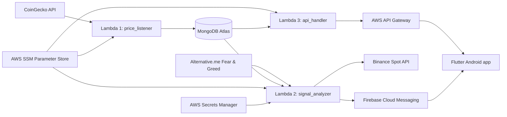

# Bitcoin Watcher

<p align="center">
  
</p>

<p align="center">
  <strong>Real-time Bitcoin intelligence for Android.</strong><br />
  A Flutter mobile app suite backed by AWS Lambda services for BTC price tracking, signal generation, push notifications, and optional Binance trade execution.
</p>

<p align="center">
  
  
  
  
  
</p>

## ✨ Overview

Bitcoin Watcher is a two-mode Bitcoin monitoring and trading project:

- **Original mode** focuses on classic **BUY / SELL / HOLD** signals using moving averages and RSI-weighted confidence.
- **Hodler mode** is built for accumulation, using a composite **Accumulation Score** plus DCA-style buy sizing and portfolio tracking.

This repository includes:

- A Flutter Android client for the original app in `lib/`
- A Flutter Android client for the hodler app in `lib_hodler/`
- Two Lambda backend implementations in `backend/lambda/` and `backend/lambda_hodler/`
- Integration tests for the live API in `backend/tests/`
- GitHub Actions workflows for packaging and deploying Lambda code

> [!IMPORTANT]
> The repo contains **two backend variants**, but the current GitHub Actions workflows deploy them to the **same Lambda function names** and the same API Gateway `prod` stage. In practice, `prod` and `hodler` are **alternate deployments**, not two permanently live stacks running side by side.

## 🚀 What It Delivers

### Original Mode

- Live BTC price card with interval-based trend charts
- BUY / SELL / HOLD signal engine
- Push notifications for actionable signals
- Notification history and trade history views
- Adjustable strategy settings from the mobile app
- Optional Binance spot execution using testnet or production credentials

### Hodler Mode

- Accumulation Score (`0-100`) for dip-buying decisions
- DCA-scaled BTC buys based on score strength
- Portfolio screen with stack size, cost basis, current value, and unrealized P&L
- Market sentiment inputs including RSI, Bollinger Bands, Fear & Greed, and dip depth
- Buy-zone notifications
- Extended settings for accumulation and trading control

## 🧭 Product Modes

| Mode | Flutter entry point | Backend folder | Signal model | Trading behavior |
| --- | --- | --- | --- | --- |
| Original | `lib/main.dart` | `backend/lambda/` | `BUY`, `SELL`, `HOLD` | Optional fixed-size buy/sell execution |
| Hodler | `lib_hodler/main_hodler.dart` | `backend/lambda_hodler/` | `BUY`, `HOLD` | Optional DCA-scaled BTC buys, no automated sell path |

## 🏗️ Architecture



### Backend responsibilities

| Function | File | Responsibility |
| --- | --- | --- |
| Lambda 1 | `price_listener.py` | Fetches BTC market data and stores snapshots in MongoDB |
| Lambda 2 | `signal_analyzer.py` | Computes signals, sends FCM notifications, and optionally executes Binance trades |
| Lambda 3 | `api_handler.py` | Exposes REST endpoints used by the Flutter app |

### Data sources and services

| Service | Purpose |
| --- | --- |
| CoinGecko | Current BTC price, and in hodler mode also 24h volume |
| MongoDB Atlas | Price history, signals, trades, failed trades, notifications, settings |
| Firebase Cloud Messaging | Push delivery to mobile clients |
| Binance Spot API | Optional trade execution on testnet or production |
| Alternative.me Fear & Greed API | Hodler sentiment input |
| AWS SSM / Secrets Manager | Runtime secrets and credentials |

## 📊 Signal Engines

### Original Strategy

- Uses recent BTC prices from MongoDB
- Computes short and long moving averages
- Uses RSI to adjust signal confidence
- Produces `BUY`, `SELL`, or `HOLD`
- Sends notifications only for `BUY` and `SELL`
- Can optionally place market buys or sells through Binance

### Hodler Strategy

The hodler engine produces a **composite Accumulation Score** from `0-100`.

| Component | Weight |
| --- | --- |
| RSI | `0-30` |
| MA divergence | `0-25` |
| Bollinger lower-band behavior | `0-20` |
| Fear & Greed Index | `0-15` |
| Dip depth from recent high | `0-10` |

Behavioral notes:

- A score greater than or equal to `min_score_threshold` enters a **buy zone**
- Hodler signals are `BUY` or `HOLD`
- `confidence` mirrors `accumulation_score` for client compatibility
- Automated trading is buy-only in hodler mode
- The `/portfolio` endpoint is derived from stored filled BUY trades

## 🔌 API Reference

**Default base URL used in the app code**

```text
https://o9tic8ti7h.execute-api.ap-northeast-1.amazonaws.com/prod
```

If your infrastructure differs, override it with:

- `API_BASE_URL` for the original client
- `HODLER_API_BASE_URL` for the hodler client

### Shared endpoints

| Endpoint | Method | Params / Body | Description |
| --- | --- | --- | --- |
| `/currentPrice` | `GET` | None | Latest BTC price and latest signal |
| `/priceHistory` | `GET` | `hours` integer, default `24` | Historical price points ordered oldest -> newest |
| `/signalHistory` | `GET` | `limit` integer, default `50` | Recent notification records |
| `/tradesHistory` | `GET` | `limit` integer, default `50` | Merged successful and failed trades |
| `/settings` | `GET` | None | Current app settings |
| `/settings` | `POST` | JSON settings payload | Upserts app settings |
| `*` | `OPTIONS` | None | CORS preflight support |

### Hodler-only endpoint

| Endpoint | Method | Params / Body | Description |
| --- | --- | --- | --- |
| `/portfolio` | `GET` | None | Aggregated BTC stack, cost basis, current value, P&L, and accumulation trade history |

### Response notes

- All responses are JSON.
- API handlers return permissive CORS headers (`Access-Control-Allow-Origin: *`).
- `timestamp` fields are ISO-8601 strings.
- `/tradesHistory` merges `trades` and `failed_trades`, sorts by timestamp descending, and caps to the requested `limit`.
- Original mode can return `BUY`, `SELL`, or `HOLD`.
- Hodler mode returns `BUY` or `HOLD`, and adds score-specific fields.
- In hodler mode, `/signalHistory` can include `accumulation_score`, and `/tradesHistory` can include `accumulation_score` plus `usdt_spent`.

<details>
<summary><strong><code>GET /currentPrice</code> — original response shape</strong></summary>

```json
{
  "price": {
    "timestamp": "2026-04-18T12:00:00",
    "price": 84500.12
  },
  "signal": {
    "_id": "661fd5f8d4e9e0cdb6a1d123",
    "timestamp": "2026-04-18T12:00:00",
    "type": "BUY",
    "price": 84500.12,
    "confidence": 74.3
  }
}
```

</details>

<details>
<summary><strong><code>GET /currentPrice</code> — hodler response shape</strong></summary>

```json
{
  "price": {
    "timestamp": "2026-04-18T12:00:00",
    "price": 84500.12
  },
  "signal": {
    "_id": "661fd5f8d4e9e0cdb6a1d456",
    "timestamp": "2026-04-18T12:00:00",
    "type": "BUY",
    "price": 84500.12,
    "confidence": 78.0,
    "accumulation_score": 78.0,
    "buy_zone": true,
    "rsi": 28.3,
    "bb_lower": 82150.0,
    "fear_greed_index": 22,
    "fear_greed_label": "Extreme Fear",
    "dip_depth": 5.2
  }
}
```

</details>

<details>
<summary><strong><code>GET /priceHistory?hours=24</code> — response shape</strong></summary>

```json
{
  "prices": [
    {
      "timestamp": "2026-04-18T08:00:00",
      "price": 83810.44
    },
    {
      "timestamp": "2026-04-18T08:01:00",
      "price": 83822.17
    }
  ]
}
```

</details>

<details>
<summary><strong><code>GET /tradesHistory?limit=50</code> — response shape</strong></summary>

```json
{
  "trades": [
    {
      "_id": "661fd5f8d4e9e0cdb6a1d999",
      "timestamp": "2026-04-18T12:05:00",
      "signal_id": "661fd5f8d4e9e0cdb6a1d123",
      "side": "BUY",
      "symbol": "BTCUSDT",
      "executed_qty": 0.00031,
      "average_price": 84492.55,
      "signal_price": 84500.12,
      "signal_confidence": 74.3,
      "status": "FILLED",
      "btc_balance_after": 0.01352,
      "error": null
    }
  ]
}
```

</details>

<details>
<summary><strong><code>GET /portfolio</code> — hodler response shape</strong></summary>

```json
{
  "total_btc_accumulated": 0.01234567,
  "total_usdt_spent": 950.0,
  "average_cost_basis": 76950.0,
  "current_btc_price": 84500.12,
  "current_value": 1043.21,
  "unrealized_pnl_percent": 9.811,
  "trade_count": 8,
  "trade_history": [
    {
      "timestamp": "2026-04-01T09:30:00",
      "btc_acquired": 0.0012,
      "cumulative_btc": 0.0012,
      "average_price": 70123.45,
      "accumulation_score": 73.0
    }
  ]
}
```

</details>

### Settings payloads

#### Original settings

| Key | Type | Default |
| --- | --- | --- |
| `notifications_enabled` | `bool` | `true` |
| `buy_threshold` | `float` | `0.005` |
| `sell_threshold` | `float` | `0.005` |
| `short_ma_period` | `int` | `7` |
| `long_ma_period` | `int` | `21` |

#### Hodler settings

| Key | Type | Default |
| --- | --- | --- |
| `notifications_enabled` | `bool` | `true` |
| `buy_threshold` | `float` | `0.001` |
| `short_ma_period` | `int` | `7` |
| `long_ma_period` | `int` | `25` |
| `rsi_period` | `int` | `14` |
| `rsi_oversold` | `int` | `30` |
| `rsi_overbought` | `int` | `70` |
| `bb_period` | `int` | `20` |
| `bb_std_dev` | `float` | `2.0` |
| `min_score_threshold` | `int` | `60` |
| `lookback_hours` | `int` | `4` |
| `trading_enabled` | `bool` | `false` |
| `trading_mode` | `string` | `testnet` |
| `trade_amount_usdt` | `float` | `20` |
| `dca_scale_factor` | `float` | `1.5` |
| `max_single_trade_usdt` | `float` | `200` |

## 🛠️ Local Development

### Prerequisites

- Flutter SDK with Dart 3
- Android SDK and an emulator or physical Android device
- Python `3.11+`
- `pytest` for backend API tests
- Doppler CLI if you want to use the helper runner

> [!NOTE]
> This repository is currently **Android-focused**. There is an `android/` project in the repo, but no `ios/` directory.

### Secrets and configuration

| Secret / variable | Where it is used | Source |
| --- | --- | --- |
| `DOPPLER_SERVICE_TOKEN` | `flutter_run.sh`, GitHub Actions | Local `.env` or `.doppler-token`, plus GitHub environment secrets |
| `API_BASE_URL` | Original Flutter client | `--dart-define` or Doppler-injected env file |
| `HODLER_API_BASE_URL` | Hodler Flutter client | `--dart-define` or Doppler-injected env file |
| `MONGODB_URI` | Local Lambda execution and tests | Local env, or AWS SSM parameter `/bitcoin-watcher/mongodb-uri` in Lambda |
| `bitcoin-watcher-firebase-creds` | Signal analyzers | AWS Secrets Manager |
| `bitcoin-watcher-binance-testnet` | Trade execution | AWS Secrets Manager |
| `bitcoin-watcher-binance-production` | Trade execution | AWS Secrets Manager |

Additional local notes:

- `.env.example` documents `MONGODB_URI` plus Binance credential placeholders for local backend work.
- `flutter_run.sh` fetches secrets from Doppler and injects them with `--dart-define-from-file`.
- Firebase Android config files such as `google-services.json` are **not committed** in this repository, so you will need to supply them for a fully configured FCM-enabled build.
- The backend is Lambda-first. There is no local REST server in this repo; the Flutter clients are designed to talk to a deployed API Gateway endpoint.

### Install dependencies

```bash
flutter pub get
```

### Run the original app

```bash
# Uses flutter_run.sh, which fetches secrets from Doppler
./flutter_run.sh

# Or run directly
flutter run -t lib/main.dart \
  --dart-define=API_BASE_URL=https://your-api.execute-api.ap-northeast-1.amazonaws.com/prod
```

### Run the hodler app

```bash
flutter run -t lib_hodler/main_hodler.dart \
  --dart-define=HODLER_API_BASE_URL=https://your-api.execute-api.ap-northeast-1.amazonaws.com/prod
```

### Build release APKs

```bash
# Original
flutter build apk -t lib/main.dart

# Hodler
flutter build apk -t lib_hodler/main_hodler.dart \
  --dart-define=HODLER_API_BASE_URL=https://your-api.execute-api.ap-northeast-1.amazonaws.com/prod
```

## 🧪 Testing

### Flutter

```bash
flutter test
```

### Live API integration tests

```bash
# Original API contract
APIGW_REST_API_ID=o9tic8ti7h pytest backend/tests/test_api.py -v

# Hodler API contract
APIGW_REST_API_ID=o9tic8ti7h pytest backend/tests/test_api_hodler.py -v
```

Testing notes:

- These are **integration tests against the deployed API Gateway**, not pure unit tests.
- The settings tests perform a POST update and then restore the original values.
- The hodler suite includes `/portfolio` coverage and checks enriched signal fields.

## 🚢 Deployment

### Original deployment flow

Workflow: `.github/workflows/deploy.yml`

- Trigger: push to the `prod` branch
- Packages `backend/lambda/` with `backend/requirements.txt`
- Uploads the zip to S3
- Updates:
  - `bitcoin-watcher-price-listener`
  - `bitcoin-watcher-signal-analyzer`
  - `bitcoin-watcher-api-handler`
- Re-deploys the API Gateway `prod` stage
- Runs `backend/tests/test_api.py`

### Hodler deployment flow

Workflow: `.github/workflows/hodler_deploy.yml`

- Trigger: push to the `hodler` branch
- Packages `backend/lambda_hodler/` with `backend/requirements_hodler.txt`
- Updates the same three Lambda function names
- Ensures the `/portfolio` API Gateway route exists
- Re-deploys the API Gateway `prod` stage
- Runs `backend/tests/test_api_hodler.py`

## 📁 Repository Layout

```text
.
├── android/                      # Android app project
├── assets/images/                # App branding assets
├── backend/
│   ├── lambda/                   # Original Lambda implementation
│   ├── lambda_hodler/            # Hodler Lambda implementation
│   ├── requirements.txt
│   ├── requirements_hodler.txt
│   └── tests/                    # Live API integration tests
├── lib/                          # Original Flutter app
├── lib_hodler/                   # Hodler Flutter app
├── .github/workflows/            # Deployment pipelines
├── flutter_run.sh                # Doppler-aware Flutter runner
└── pubspec.yaml                  # Shared Flutter dependencies
```

## 📌 Operational Notes

- Both Flutter apps share the same `pubspec.yaml`.
- Both backend variants publish notifications to the FCM topic `bitcoin-signals`.
- The original client auto-subscribes to `bitcoin-signals`.
- Price ingestion currently comes from **CoinGecko**, not Binance market data.
- The codebase stores trade failures separately in `failed_trades`, and the API merges them into trade history for UI visibility.

## 📄 License

No license file is currently present in this repository.
